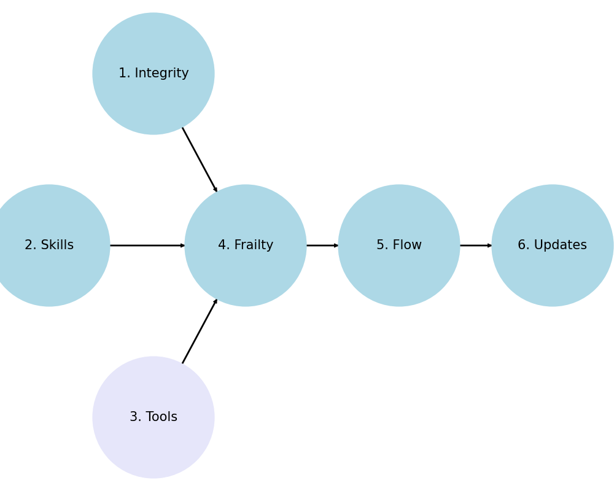

> Human was the music       
Natural the static      

                                             1. Senses
                                                      \
                                  2. Neuralnetworks -> 4. Communicate -> 5. Leadership -> 6. Accomplishments
                                                      /
                                                      3. Harden

### Dionysus [1](https://abikesa.github.io/jerryseinfeld/), 2, [3](https://en.wikisource.org/wiki/An_Attempt_at_Self-Criticism)
### Sing O Muse! [4](https://abikesa.github.io/why-python/)
### Apollo 5, [6](https://www.gutenberg.org/files/174/174-h/174-h.htm)

# "Beyond Good and Evil" (1886)

1. **Senses & Affirmation of Life**: Nietzsche's philosophy evolved towards an affirmation of life, embracing chaos, passion, and the will to power, which are more closely aligned with the Dionysian. The Dionysian embodies the primal forces of life and creation, elements Nietzsche increasingly valued.

2. **Mind & Critique of Rationality**: Nietzsche became increasingly critical of Enlightenment rationality and the constraints it imposed on human creativity and vitality. The Apollonian, with its association to order and reason, may have come to represent these constraints, which Nietzsche saw as life-denying.

3. **Tools & Schopenhauerian Influence**: Initially influenced by Schopenhauer’s philosophy, which emphasized the world as representation (Apollonian) and the world as will (Dionysian), Nietzsche eventually critiqued and moved beyond Schopenhauer’s pessimism. He found a more affirmative vision in the Dionysian, which celebrated the will to life and artistic creation without the need for the Apollonian counterbalance.

4. [Personal Evolution](https://www.gutenberg.org/files/1998/1998-h/1998-h.htm#link2H_4_0003): Nietzsche’s own intellectual journey and psychological struggles likely played a role. His break with Wagner, the symbol of his early Apollonian-Dionysian synthesis, marked a significant personal and philosophical shift. Wagner’s later work, which Nietzsche saw as nationalistic and decadent, contrasted sharply with the pure artistic vision Nietzsche once admired. He no longer believes in the interplay of opposing forces leading to a higher synthesis. That, to him, began to reek of a `Will-to-systematizing`. By contrast, one whose cup overflow, like [Babyface](https://abikesa.github.io/edmonds/), will keep churning out stuff that represents updated experiences, knowledge, tools, frailty (robust, pre-, frail), cup-runneth-over (if at all), updates. Those who touch the "hem of his garmet", Toni Braxton, Boyz-II-Men, etc. shall never thirst from this [overflow](https://en.wikipedia.org/wiki/Relaxation_(psychology)).

5. Dionysian as Pessimism. Nietzsche’s shift from the duality of the Apollonian (rational, ordered, and beautiful) and Dionysian (chaotic, ecstatic, and sublime) to a more [exclusive focus](https://en.wikipedia.org/wiki/Nihilism#Positions) on the Dionysian reflects his evolving philosophical perspective and his eventual disillusionment with the overly structured, rational side represented by the Apollonian. This is his embrace of a pessimism that permeates his mature works. This Dionysian monster thought the human race was irredeemable, as did Solomon in Ecclesiastics, Shakespears in Macbeth, and Mozart in Don Giovani. But this monster is the very emblem of the notion that [excess](https://www.handprint.com/SC/NIE/GotDamer.html#:~:text=Excess%20strength%20alone%20is%20the,all%2Dtoo%2Dheavy%20seriousness.) strength alone is the proof of strength. It is this over[flow](https://www.gutenberg.org/files/52263/52263-h/52263-h.htm), whereby the [cup runneth over](https://www.biblegateway.com/passage/?search=Psalm+23%3A5&version=KJV), that [benefits others](https://www.biblegateway.com/passage/?search=Matthew%2022%3A37-40&version=KJV). This isn't faith (Candace Owens) or love (St. Paul), but rather the hope (The Nazarine) by which many sheep flock to a shepherd... the [hem](https://www.biblegateway.com/passage/?search=Matthew%209%3A18-26%2CMark%205%3A22-43%2CLuke%208%3A41-56&version=KJV) of his garmet
   
6. Optimism as Apollonian. An [exuberant optimism](https://www.gutenberg.org/files/174/174-h/174-h.htm) that has a Bishop reciting at 80 years what he has been doing since he was 18 years. But all this risks drawing one into nihilism. And thats where [iteration](https://abikesa.github.io/iterate/intro.html) comes in. With chaos as input at the bottom layer of a neuralnetwork, iteration represents layers and layers of processesing and "compute" that will reveal patterns and yield power to the one who harnesses and harvests this resource. Usually culutural heritage over millenia has offered this edge, but the training of neural networks with massive "compute" and unlimited data will abbreviate this process, as we witnessed from 2023=2024, where OpenAI became the go-to for both Microsoft & Apple. Their success spawned imitation by Google and Meta. We are cheerful since this isn't build on any will-to-systematization; we are very much embracing chaos or "honest" data from the real world. So out of the spirit of music, we are encoding all that natural static into a harmonic series and an equally-tempered chromatic scale. **Don’t be so serious. What have you or I to do with the superstitions of our age? No: we have given up our belief in the soul. Play me something. Play me a `nocturne`, Dorian, and, as you play, tell me, in a low voice, how you have kept your youth. You must have some secret**

