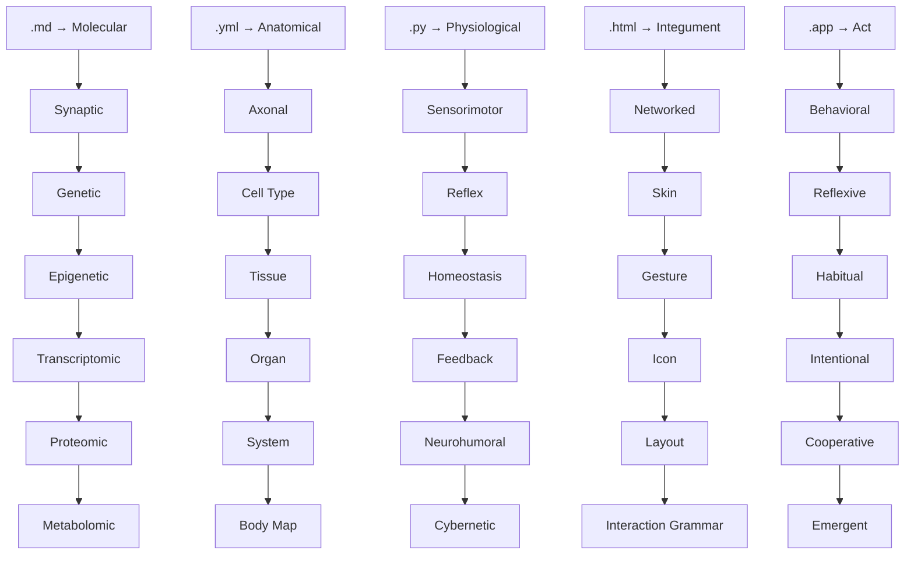

```mermaid
graph TD
  %% Layer 1: Molecular / Synaptic / .md
  MD[.md → Molecular] --> MD1[Synaptic]
  MD1 --> MD2[Genetic]
  MD2 --> MD3[Epigenetic]
  MD3 --> MD4[Transcriptomic]
  MD4 --> MD5[Proteomic]
  MD5 --> MD6[Metabolomic]

  %% Layer 2: Cellular / Axonal / .yml
  YML[.yml → Anatomical] --> YML1[Axonal]
  YML1 --> YML2[Cell Type]
  YML2 --> YML3[Tissue]
  YML3 --> YML4[Organ]
  YML4 --> YML5[System]
  YML5 --> YML6[Body Map]

  %% Layer 3: Ganglionic / Sensorimotor / .py
  PY[.py → Physiological] --> PY1[Sensorimotor]
  PY1 --> PY2[Reflex]
  PY2 --> PY3[Homeostasis]
  PY3 --> PY4[Feedback]
  PY4 --> PY5[Neurohumoral]
  PY5 --> PY6[Cybernetic]

  %% Layer 4: Hippocampal / Network / .html
  HTML[.html → Integument] --> HTML1[Networked]
  HTML1 --> HTML2[Skin]
  HTML2 --> HTML3[Gesture]
  HTML3 --> HTML4[Icon]
  HTML4 --> HTML5[Layout]
  HTML5 --> HTML6[Interaction Grammar]

  %% Layer 5: Prefrontal / Behavioral / .app
  APP[.app → Act] --> APP1[Behavioral]
  APP1 --> APP2[Reflexive]
  APP2 --> APP3[Habitual]
  APP3 --> APP4[Intentional]
  APP4 --> APP5[Cooperative]
  APP5 --> APP6[Emergent]

```
